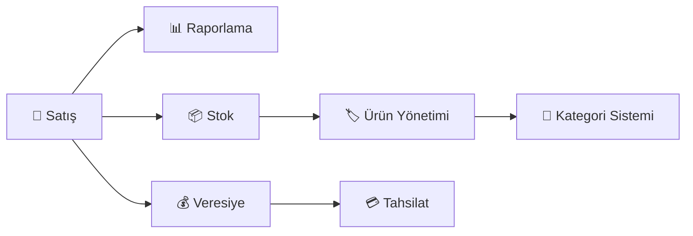

<div align="center">

# 🛒 Market Ödeme Otomasyonu

### Modern, Hızlı ve Kullanıcı Dostu Market Satış Yönetim Sistemi

[](https://www.php.net/)
[](https://developer.mozilla.org/en-US/docs/Web/HTML)
[](https://developer.mozilla.org/en-US/docs/Web/CSS)
[](https://developer.mozilla.org/en-US/docs/Web/JavaScript)
[](https://getbootstrap.com/)

</div>

---

## 📋 Overview

**Market Ödeme Otomasyonu**, küçük ve orta ölçekli marketler için geliştirilmiş, modern bir satış ve stok yönetim sistemidir. Barkod okuyucu desteği, hızlı ürün ekleme, veresiye takibi ve detaylı satış raporlama özellikleriyle işletmenizi dijitalleştirin.

### ✨ Temel Özellikler



---

## 🎯 Features

<table>
<tr>
<td width="50%">

### 🔥 Satış İşlemleri
- ✅ **Barkod Okuyucu Desteği**
- ✅ **Manuel Ürün Girişi**
- ✅ **Hızlı Fiyat Ekleme**
- ✅ **Gerçek Zamanlı Sepet Yönetimi**
- ✅ **Otomatik Toplam Hesaplama**

</td>
<td width="50%">

### 📦 Stok Yönetimi
- ✅ **Ürün Ekleme/Düzenleme/Silme**
- ✅ **Kategori Bazlı Organizasyon**
- ✅ **Otomatik Stok Takibi**
- ✅ **Stok Uyarı Sistemi**
- ✅ **Barkod Sistemi**

</td>
</tr>
<tr>
<td width="50%">

### 💰 Mali Yönetim
- ✅ **Veresiye Takibi**
- ✅ **Müşteri Borç Yönetimi**
- ✅ **Tahsilat İşlemleri**
- ✅ **Detaylı Finansal Raporlar**
- ✅ **Günlük/Aylık Satış Özeti**

</td>
<td width="50%">

### 📊 Raporlama
- ✅ **Günlük Satış Raporları**
- ✅ **Aylık Gelir Analizi**
- ✅ **Kategori Bazlı İstatistikler**
- ✅ **Çok Satılan Ürünler**
- ✅ **Grafiksel Veri Görselleştirme**

</td>
</tr>
</table>

---

## 🚀 Quick Start

### Gereksinimler

```bash
✓ PHP 7.4 veya üzeri
✓ Web sunucusu (Apache, Nginx, vb.)
✓ Modern web tarayıcı (Chrome, Firefox, Safari, Edge)
```

### 📥 Kurulum

1️⃣ **Projeyi klonlayın**
```bash
git clone https://github.com/kullaniciadi/market-otomasyon.git
cd market-otomasyon
```

2️⃣ **Gerekli dosya izinlerini ayarlayın**
```bash
chmod 755 .
chmod 666 *.json
mkdir -p purchases
chmod 755 purchases
```

3️⃣ **Web sunucunuzu başlatın**

**Apache/Nginx ile:**
```bash
# Proje dizinini web sunucunuzun root klasörüne taşıyın
# Örn: /var/www/html/ veya /usr/share/nginx/html/
```

**PHP Development Server ile:**
```bash
php -S localhost:8000
```

4️⃣ **Tarayıcınızda açın**
```
http://localhost:8000/index.html
```

---

## 📁 Project Structure

```
market-otomasyon/
├── 📄 index.html              # Ana satış ekranı
├── 📄 add-product.html        # Yeni ürün ekleme
├── 📄 edit-product.html       # Ürün düzenleme
├── 📄 categories.html         # Kategori yönetimi
├── 📄 credit-sales.html       # Veresiye yönetimi
├── 📄 sales-report.html       # Satış raporları
│
├── 🔧 api.php                 # Ürün API endpoint'leri
├── 🔧 category-api.php        # Kategori API endpoint'leri
├── 🔧 credit-api.php          # Veresiye API endpoint'leri
│
├── 📊 products.json           # Ürün veritabanı
├── 📊 categories.json         # Kategori veritabanı
├── 📊 credits.json            # Veresiye kayıtları
├── 📊 debts.json              # Borç kayıtları
│
├── 📁 purchases/              # Satış kayıtları
│   ├── 01-2025/              # Ay-Yıl klasörleri
│   │   ├── 01.json          # Günlük satışlar
│   │   ├── 02.json
│   │   └── ...
│   └── ...
│
└── 📖 README.md
```

---

## 💻 Tech Stack

<div align="center">

| Teknoloji | Kullanım Alanı | Versiyon |
|-----------|----------------|----------|
|  | Backend API | 7.4+ |
|  | Frontend Logic | ES6+ |
|  | UI Framework | 5.3.2 |
|  | Markup | 5 |
|  | Styling | 3 |
|  | Data Storage | - |

</div>

---

## 🎨 Screenshots

<details>
<summary>📸 Ekran Görüntülerini Göster</summary>

### Ana Satış Ekranı
> Modern, gradient renklerle tasarlanmış ana satış paneli

### Ürün Kataloğu
> Kategori bazlı organize edilmiş, arama ve filtreleme özellikli katalog

### Satış Raporları
> Grafiksel veri görselleştirme ile detaylı satış analizi

### Veresiye Yönetimi
> Müşteri bazlı borç takibi ve tahsilat ekranı

</details>

---

## 🔧 Configuration

### Ürün Ekleme

```javascript
// Yeni ürün eklemek için products.json formatı
{
  "id": 1,
  "barcode": "8690000000001",
  "name": "Ürün Adı",
  "stock": 50,
  "price": 29.90,
  "desc": "Ürün açıklaması",
  "category": "Kategori Adı",
  "img": ""
}
```

### Kategori Ekleme

```javascript
// categories.json formatı
{
  "id": 1,
  "name": "Kategori Adı",
  "icon": "bi bi-box-seam",
  "color": "#667eea"
}
```

---

## 📊 API Endpoints

### Ürün İşlemleri
```http
GET    /api.php?action=getProducts      # Tüm ürünleri listele
POST   /api.php?action=addProduct       # Yeni ürün ekle
PUT    /api.php?action=updateProduct    # Ürün güncelle
DELETE /api.php?action=deleteProduct&id=1  # Ürün sil
POST   /api.php?action=purchase         # Satış işlemi
GET    /api.php?action=getSales         # Satış kayıtları
```

### Veresiye İşlemleri
```http
GET    /credit-api.php?action=getCredits    # Veresiye listesi
POST   /credit-api.php?action=addCredit     # Yeni veresiye ekle
POST   /credit-api.php?action=payCredit     # Veresiye tahsilat
DELETE /credit-api.php?action=deleteCredit&id=1  # Veresiye sil
```

### Kategori İşlemleri
```http
GET    /category-api.php?action=getCategories     # Kategori listesi
POST   /category-api.php?action=addCategory       # Yeni kategori
PUT    /category-api.php?action=updateCategory    # Kategori güncelle
DELETE /category-api.php?action=deleteCategory&id=1  # Kategori sil
```

---

## 🎯 Usage Guide

### 🛒 Satış Yapma

1. **Barkod Okutma**: Ürün barkodunu okutun veya manuel girin
2. **Sepete Ekleme**: Ürünler otomatik olarak sepete eklenir
3. **Miktar Ayarlama**: Sepetteki ürün miktarlarını + / - butonları ile ayarlayın
4. **Ödeme**: "Ödemeyi Tamamla" butonu ile satışı sonlandırın
5. **Veresiye**: "Veresiye Yaz" ile müşteri adı girerek veresiye kaydedin

### 📦 Stok Yönetimi

1. **Ürün Ekleme**: "Yeni Ürün Ekle" sayfasından yeni ürün tanımlayın
2. **Ürün Düzenleme**: "Ürün Düzenle" sayfasından mevcut ürünleri güncelleyin
3. **Stok Takibi**: Satış yapıldıkça stok otomatik güncellenir
4. **Kategori Yönetimi**: "Kategoriler" sayfasından kategori ekleyin/düzenleyin

### 💰 Veresiye Yönetimi

1. **Veresiye Kayıt**: Satış ekranından "Veresiye Yaz" butonunu kullanın
2. **Tahsilat**: "Veresiyeler" sayfasından müşteri borcunu ödeyin
3. **Detaylı Görüntüleme**: Her veresiye kaydının detaylarını görüntüleyin
4. **Ödeme Geçmişi**: Müşteri bazlı ödeme takibi yapın

### 📊 Raporlama

1. **Günlük Rapor**: Günlük satış toplamlarını görüntüleyin
2. **Aylık Analiz**: Ay bazlı gelir grafiklerini inceleyin
3. **Kategori İstatistikleri**: Hangi kategorilerin daha çok satıldığını görün
4. **En Çok Satılanlar**: Popüler ürünleri belirleyin

---

## 🔐 Security Features

- ✅ **JSON-based veri depolama** (hafif ve hızlı)
- ✅ **CORS desteği** (güvenli API erişimi)
- ✅ **Input validasyonu** (hatalı veri girişi önleme)
- ✅ **Stok kontrol sistemi** (negatif stok engelleme)
- ✅ **Dosya izin yönetimi** (güvenli dosya erişimi)

---

## 🎨 UI/UX Features

### Modern Tasarım Özellikleri

- 🎨 **Gradient Renkler**: Modern ve canlı renk paleti
- 🔄 **Animasyonlar**: Akıcı geçiş efektleri
- 📱 **Responsive Design**: Mobil, tablet ve masaüstü uyumlu
- 🌈 **Bootstrap Icons**: 1500+ ikona anında erişim
- ⚡ **Hızlı Yükleme**: Optimize edilmiş performans
- 🎯 **Kullanıcı Dostu**: Sezgisel arayüz tasarımı

### Renkli Kategori Sistemi

Her kategori için özelleştirilebilir renk ve ikon seçimi:
- 🥛 Süt Ürünleri → Mavi tonları
- 🍞 Gıda → Turuncu tonları
- 🍫 Atıştırmalık → Pembe tonları
- 🥤 İçecek → Cyan tonları

---

## 🤝 Contributing

Katkıda bulunmak isterseniz:

1. Bu repo'yu fork edin
2. Feature branch'i oluşturun (`git checkout -b feature/AmazingFeature`)
3. Değişikliklerinizi commit edin (`git commit -m 'Add some AmazingFeature'`)
4. Branch'inizi push edin (`git push origin feature/AmazingFeature`)
5. Pull Request oluşturun

---

## 📝 Changelog

### v1.0.0 (2025-01-01)
- ✨ İlk sürüm yayınlandı
- ✅ Temel satış işlemleri
- ✅ Stok yönetimi
- ✅ Veresiye sistemi
- ✅ Kategori yönetimi
- ✅ Satış raporlama
- ✅ Modern UI/UX tasarımı

---

## 🐛 Known Issues

- Büyük veri setlerinde (1000+ ürün) performans optimizasyonu gerekebilir
- Çoklu kullanıcı desteği henüz bulunmuyor
- Otomatik yedekleme özelliği eklenmesi planlanıyor

---

## 🗺️ Roadmap

- [ ] 🔐 Kullanıcı giriş sistemi
- [ ] 📧 E-posta/SMS bildirim entegrasyonu
- [ ] 💾 Veritabanı desteği (MySQL/PostgreSQL)
- [ ] 📱 Mobil uygulama (React Native)
- [ ] 🖨️ Fiş/fatura yazdırma
- [ ] 📊 Gelişmiş analitik dashboard
- [ ] 🌐 Çoklu dil desteği
- [ ] ☁️ Cloud yedekleme

---

## 📄 License

Bu proje MIT lisansı altında lisanslanmıştır. Detaylar için [LICENSE](LICENSE) dosyasına bakın.

---

## 👨‍💻 Author

**Geliştirici Adı**

- 🌐 Website: [erdemskywalker.site](https://erdemskywalker.site)
- 📧 Email: turanerdeyusuf28@gmail.com
- 💼 LinkedIn: [linkedin.com/in/erdemskywalker](https://linkedin.com/in/erdemskywalker)
- 🐙 GitHub: [@username](https://github.com/erdemskywalker)

---

## 📞 Support

Sorularınız veya önerileriniz için:

- 📧 **Email**: turanerdeyusuf28@gmail.com
- 💬 **Issues**: [GitHub Issues](https://github.com/erdemskywalker/market-otomasyon/)
- 📖 **Documentation**: [Wiki](https://github.com/erdemskywalker/market-otomasyon/)

---

<div align="center">

### ⭐ Bu projeyi beğendiyseniz yıldız vermeyi unutmayın!

**Made with ❤️ and ☕**

</div>
